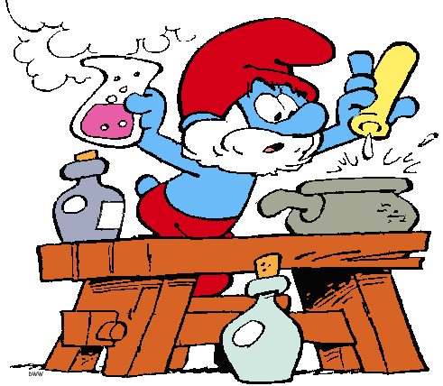

# Big Excercise
## Papa Smurf's potion store
Papa Smurf is a well known potions brewer. Smurfs from all over the world travel to our small town, in order to buy his potions.
As his evergrowing fame keeps on growing, papa smurf's workload grows with it. He's been brewing potions non stop lately and with barely enough time to eat and sleep.
But then disaster strikes: Papa smurf is running low on troll's toe cheese and in his desperation he turns to us for help.
This is what he needs:

> **UserStories**
>
1. Papa smurf needs a service to keep track of all the ingredients he has left in his closet, without having to count them himself.
2. His closet contains 5 shelves, each shelf for a category of ingredients: -liquid ingredients -herbs & spices -special types of rock -rare ingredients -miscelanious ingredients
3. Ingredients should have a name, description, price and a gathering date as some products tent to expire rather quickly.
4. Papa smurf would like to see these lists, in 2 ways: -all categories side by side, displaying only ingredient name & amount. -a page for each category displaying all ingredients of that category in detail. Details of the same products but with different gathering date should be grouped by gathering date. 
5. Liquid ingredients generally expire after a month, herbs after 1 week,rocks don't expire,rare & miscelanious items have a item specific expiery time
6. 

